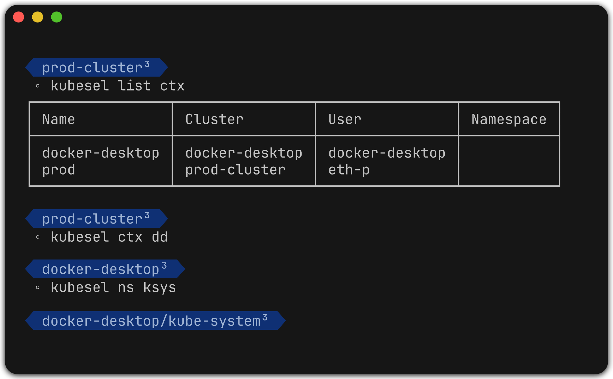

# kubesel

Kubesel (**kube**config **sel**ector) is your modern approach to working with
[kubectl](https://kubernetes.io/docs/reference/kubectl/) configuration in a
multi-cluster, multi-namespace environment. Quickly and easily change your
active kubectl context, namespace, and cluster through a single program.



Designed from the ground up using the [KUBECONFIG environment variable](https://kubernetes.io/docs/concepts/configuration/organize-cluster-access-kubeconfig/#the-kubeconfig-environment-variable),
kubesel creates and manages a unique kubeconfig file for each shell session.
If you change your cluster in one pane, it won't affect the other pane where
you were planning on running `kubectl delete`.


---

**Table of Contents:**

 - [Installation](#installation)
   - [Setup](#setup)
 - [Features](#features)
 - [Usage](#usage)
 - [Tips](#tips)
   - [List Output Formats](#list-output-formats)
   - [Adding Kubeconfig Files From a Directory](#adding-kubeconfig-files-from-a-directory)
 - [Alternatives](#alternatives)

---

## Installation

**With Go:**

```bash
go install github.com/eth-p/kubesel
```

**With Nix:**
```bash
nix profile install github:eth-p/kubesel
```

### Setup

For kubesel to set contexts/namespaces per shell, it needs to be able to
generate and manage a kubeconfig file associated with specific instances
of the shell. To do this, `kubesel init` creates a shell script that
will generate the file and update the `KUBECONFIG` environment variable.

While you can run the command manually, it is **highly** recommended to set
up your `.profile`/`.rc` files to automatically run it whenever a new
interactive shell is created. Doing it this way eliminates the risk of multiple
shells accidentally sharing the same kubesel-managed kubeconfig file.

> [!note]
> The `KUBECONFIG` environment variable should be set *before* `kubesel init`
> is run.

<details>
<summary><b>Bash</b></summary>

Add this to `~/.bash_profile`:

```bash
if [[ $- = *i* ]]; then
    source <(kubesel init bash)
fi
```

</details>

<details>
<summary><b>Zsh</b></summary>

Add this to `~/.zshrc`:

```zsh
source <(kubesel init zsh)
```

</details>

<details>
<summary><b>Fish</b></summary>

Add this to `~/.config/fish/config.fish`:

```fish
if status is-interactive
    kubesel init fish | source
end
```

</details>


## Features

 - [x] Per-shell context (cluster, user, and namespace).
 - [x] Supports
       [bash](https://www.gnu.org/software/bash/),
       [zsh](https://www.zsh.org/), and
       [fish](https://fishshell.com/).
 - [x] Shell completions.
 - [x] Fuzzy matching contexts/clusters/users/namespaces.
 - [x] A fzf interface for picking contexts/clusters/users/namespaces.
 - [x] Preserves OIDC authentication refresh tokens.
 - [x] Shell-scripting friendly `list` subcommand.
 - [x] Manual pages.
 - [x] Fancy ANSI colors! (optional)

## Usage

**Change Cluster, User, or Namespace:**
```bash
kubesel cluster my-cluster      # use this cluster
kubesel user my-user            # use this user
kubesel namespace my-namespace  # use this namespace
```

**Change Cluster, User, _and_ Namespace:**
```bash
# Use the cluster, user, and namespace from this context.
kubesel context my-context
kubesel context my-context -n # keep the current namespace
```

**View Contexts, Clusters, Users, or Namespaces:**
```bash
kubesel list clusters
kubesel list contexts
kubesel list users
kubesel list namespaces
```

## Tips

### List Output Formats

The `kubesel list` command supports changing its output format with `--output`.  
Supported formats are:

 - `list` for just the names in an unsorted list
 - `table` for a table
 - `col` for columns
 - `col=COL1,COL2` for specific columns
 - `col=*` for _all_ columns

### Adding Kubeconfig Files From a Directory

If you keep each cluster in a different kubeconfig file, you can have kubesel
automatically include them during initialization:

```bash
ls ~/.kube/configs
# prod.yaml
# staging.yaml
# dev.yaml
# kind-myapp.yaml

# Use the `--add-kubeconfigs` flag to include them with a glob pattern.
kubesel init --add-kubeconfigs='~/.kube/configs/*.yaml'
```

## Alternatives

### kubectx
https://github.com/ahmetb/kubectx

 - ✅ Shell completions.
 - ✅ Fuzzy-finding.
 - ⚠️ Changes affect all shells.

### kubesess
https://github.com/Ramilito/kubesess

 - ✅ Per-shell cluster/namespace/context.
 - ✅ Fuzzy-finding.
 - ⚠️ Does not support OIDC refresh tokens.

### fish-kubeswitch
https://github.com/eth-p/fish-kubeswitch

 - ✅ Per-shell cluster/namespace/context.
 - ✅ Shell completions.
 - ⚠️ Only supports [fish shell](https://fishshell.com/).
 - ⚠️ Wraps kubectl as a shell function.

## Packaging

### Go Build Tags

 - **`no_init_completions`**  
   Removes shell completion loading from the `kubesel init` scripts.
